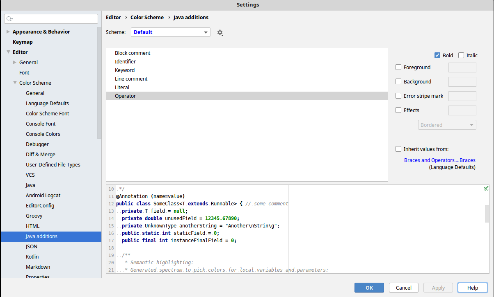
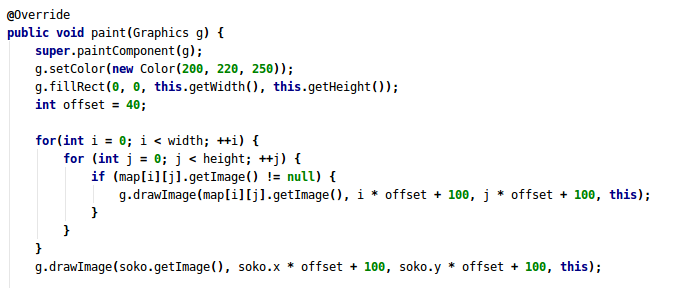

author: |
    | Gera Dóra
    | Konzulens: Simon Balázs
--- 

---
date: |
    | 2019. 12. 16.
--- 

---
output:
  pdf_document:
    toc: true
    toc_depth: 5
    toc_title: Tartalomjegyzék
---

---
geometry:
- top=30mm
- left=30mm
- heightrounded

linkcolor: blue

...

\pagebreak

## A feladat leírása

Syntax highlighter plugin készítése JetBrains fejlesztőkörnyezethez. A plugin legyen képes a választott programnyelv (Java) kulcsszavait felismerni és kiszínezni (a kód többi részétől eltérő színnel).

Az elkészült projekt forráskódja itt található: [https://github.com/doragera/Syntax-Highlighter-for-Java](https://github.com/doragera/Syntax-Highlighter-for-Java)

## A plugin mint kiegészítő szoftver

A plugin egy olyan szoftver, amit egy meglévő rendszerhez lehet külön telepíteni. A különböző programozási nyelvekhez sokféle fejlesztőkörnyezetet lehet találni. Egy ilyen környezet feladata a fejlesztés egyes lépéseinek megkönnyítése. A kódolást és a programkód áttekinthetőségét syntax highlightinggal segíti, majd a fordítást, linkelést és a futtatást is kényelmesebbé teszi. Ez a plugin Java nyelvű forrásfájlokhoz ad testreszabható kódszínezést IntelliJ IDEA fejlesztőkörnyezetben.

### A fordítás és lépései

(ez nem biztos, hogy itt lesz)

A fordítás a szöveges forrásnyelv átvitele a célnyevre a jelentés megtartásával. A célnyelv számítógép által értelmezhetőnek kell lennie. A programozási nyelveket csoportosítani lehet a fordításuk szerint:

* előfordítás: előzetes hibaellenőrzés után fordítás egy köztes kódra

* futás-idejű fordítás: köztes kód továbbfordítása köztes kódra

* teljes fordítás: közvetlen fordítás gépi kódra

* interpretálás: a kifejezések értelmezése és fordítása egyenként
<!-- -->

Ezek után az előfordítást fogom részleteiben megvizsgálni, annak is az úgynevezett frontend részét, mert a Java programnyelv is előfordítással fordul Java byte kódra.

Az első lépés a lexikai elemzés. Ennek bemenete a forrásnyelv és a lexer feladata, hogy ezt feldarabolja jelentéssel bíró egységekre, azaz tokenekre. Definiálása reguláris kifejezésekkel történik, megvalósítása egy véges automata, kimenete a tokenek sorozata. Itt kerülnek kihagyásra a felesleges a karakterek, azaz a kommentek és whitespace-ek.

A szintaktikai elemzés a következő lépés, ahol a parser feladata a lexer által előállított tokenek sorozatából fastruktúrát építeni. Kétféle fastruktúra létezik, a CST-ben (concrete syntax tree) minden token benne van, míg az AST-ben (abstract syntax tree) csak a fontos tokenek, tehát a pontosvessző és zárójelezések már nincsenek. A parser definiálása CF (context free) nyelvtannal történik.

Az utolsó lépés a szemantikai elemzés, aminek a feladata a hiányzó kontextus-információk felderítése, és ezek hozzáadása a szintaxisfához.

## Felhasznált technológiák

### ANTLR4

Az ANTLR4 segítségével nyelvtanokat lehet leírni, majd azokból a lexer és parser kódját legenerálni a válaszott forrásnyelvre.
Az IntelliJ-hez le lehet tölteni ANTLR4 kódot támogató kiegészítőt, aminek segítségével a nyelvtant deklaratívan meg lehet adni, majd legenerálni a szükséges forrásfájlokat.

###### ANTLR4 IntelliJ Adaptor
Az ANTLR4 által generált lexer és parser osztályok nem kompatibilisek az IDEA SDK-ban lévő interfészekkel, ezért egy [külső könyvtárat](https://github.com/antlr/antlr4-intellij-adaptor) kell felhasználni, ami támogatja az ANTLR4 nyelvtanok használatát pluginfejlesztéshez.

### IntelliJ IDEA

Az IntelliJ IDEA egy Java IDE a JetBrains-től. Ehhez a fejlesztőkörnyezethez készült a plugin.

###### IntelliJ SDK

A plugin fejlesztéséhez szükség van az IDEA forráskódjához, a JDK mellett. A forráskód [GitHub](https://github.com/JetBrains/intellij-community)-on található meg. A repository klónozása és lefordítása után, a plugin projektstruktúrájában az SDK-hoz hozzá kell adni. 

### Gradle

A Gradle egy projektépítő eszköz, amely a Maven koncepciójára épül, és bevezeti a projektkonfiguráció deklarációját domain-specifikusan a hagyományosabb XML forma helyett.

## A projekt

A projekt Java nyelvű forrásfájlokból, az ANTLR4 nyelvtan leírójának fájljaiból és a gradle build eszköz fájljaiből, valamint a `plugin.xml`-ből áll.
A plugin működéséhez szükséges feladatok: A pluginnak fel kell ismerni a .java kiterjesztésű fájlokat és csak ezekkel dolgozni. A fájlok kiterjesztése és nyelvének ismerete után a lexer és parser forráskódjának segítségével a kódot ki kell színezni, majd egy felületet biztosítani, ahol a különböző típusú kulcsszavaknak definiálni lehet a sznét, megjelenítési formáját.

A projektben használt osztályok és azok rövid leírása:

* `JavaFileType` : a fájltípus regisztrálásáért felelős osztály
* `JavaFileTypeFactory` : az IntelliJ SDK számára megadja a használt fájltípusokat
* `JavaLanguage` a fájltípushoz tartozó nyelv regisztrálásáért felelős osztály

* `JavaLexer` : a kód tokenekre bontásáért felelős osztály, a lexer implementációja, generált
* `JavaParser` : a tokenek sorozatából AST építéséért felelős osztály, a parser implementációja, generált
* `JavaAntlrLexerAdaptor` : a JavaLexer osztály illesztése a környezet által megadott Lexer osztály interfészéhez 
* `JavaAntlrParserAdaptor` : a JavaParser osztály illesztése a környezet által megadott Parser osztály interfészéhez

* `JavaParserDefinition` : a lexer és parser osztályok regisztrálásáért felelős osztály
* `JavaPsiFile` : a PSI fa gyökerében lévő elem implementálásáért felelős osztály (PSI definiálása ld. később)

* `JavaSyntaxHighlighter` : a kódszínezés kontrollásáért felelős osztály
* `JavaSyntaxHighlighterFactory` : az IntelliJ SDK számára megadja a használt syntax highlighter osztályt

* `JavaColorSettingsPage` : az SDK számára megadja a tetreszabott felületet a tokentípusok megjelenítéséről

Az előbb felsorolt osztályok nagy része a környezet által biztosított osztályokból származnak le, vagay interfészt implementálnak. Ezeknek a neve megegyezik az osztály nevével a "Java" prefixet levéve.

### Language és FileType

Az első lépés a fájltípus regisztrálása a `LanguageFileType` osztályból való leszármazással. Ezen kívül a környezet biztosít egy `FileTypeFactoy` osztályt, amiből szintén le kell származni és felüldefiniálni az absztrakt függvényeit. Az utóbbi osztályt a `com.intellij.fileTypeFactory` kiegészítési ponton (extension point) is regisztrálni kell a plugin.xml-ben.

A `LanguageFileType` osztály a konstruktorában egy `Language` osztályt ad át, amit szintén nekünk kell implementálni az ősosztály alapján. Az IDE egy fájl típusát alapvetően a nevéből határozza meg, azon belül is a kiterjesztésből, ezért a `LanguageFileType` osztályban fontos a `getDefaultExtension()` függvény felüldefiniálása, mert itt a fájltípushoz tartozó nyelv kiterjesztését kell visszaadni, ami alapján majd a környezet azonosítja a fájlokat. 

A `Language` osztály a singleton mintát követi, azaz egy publikus elérésű, statikus `Language` típusú objektum van benne egyetlen adattagként.

### Lexer és Parser

Ha már megvannak a kiszínezendő fájlok és azok kódjai, akkor a következő lépés a lexikai és szintaktikai elemző definiálása.
Az ANTLR4 nyelvtanok sok programozási nyelvhez definiálva vannak. A Java nyelvhez [itt](https://github.com/antlr/grammars-v4/tree/master/java) található. Értelemszerűen a `JavaLexer.g4` a lexer kódját míg a `JavaParser.g4` a parser kódját tartalmazza. A fejlesztőkörnyezet egy plugin segítségével ezekből képes legenerálni a `JavaLexer` és `JavaParser` osztályokat. Ezeket az osztályokat egy adaptor segítségével tudjuk felhasználni. Az adaptor osztályokban a konstruktorokat kell definiálni, ahol példányosítjuk a generált lexer illetve parser osztályokat.

### ParserDefinition

A lexer alapozza meg a kódszínezés alapjait. Az IDE több különböző kontextusban hívhatja meg. Az első a syntax highlighting, erről részleteiben később. Egy második lehetőség a `ParserDefinition` osztályon keresztül.  Az IntelliJ platformon a parse-olás két lépésből áll, az első az abstract syntax tree (AST) felépítése, a második lépés a Program Structure Interface (PSI) ráépítése az AST-re, azaz a szemantikai elemzés. A `ParserDefinition` osztály implementációját szintén regisztrálni kell a plugin.xml-ben, ez köti össze a lexer és parser osztályokat a környezettel.

Az AST `ASTNode` elemekből épül fel, míg a PSI `PsiElement` példányokból. Utóbbihoz a ANTLR4 IntelliJ Adaptor biztosít implementációt az `ANTLRPsiNode` osztállyal. Továbbá a `ParserDefinition` osztályban implementálni kell a `createLexer()` és `createParser()` függvényeket is. 

Minden fájlhoz egy PSI tartozik, ennek a fának a gyökerében egy `PsiFile` áll, amit a ParserDefinition osztály konstruál, de az implementációját nekünk kell megadni. A `createParser()` függvény által visszaadott parser szolgálja azt a feladatot, hogy a lexer kimeneteként kapott tokenek sorozatából épített AST-t az osztály megkapja. Fontos, hogy a parser minden tokent feldolgozzon, még akkor is, ha a kapott token nem valid az adott nyelv szerint. Ebben az osztályban kell megadni a nem fontos tokeneket is, azaz definiálni kell a whitespace és komment tokeneket, hiszen ez a parse-oláshoz tartozik.

### SyntaxHighlighter

A syntax highlighting működéséhez még szükség van a `SyntaxHighlighterBase` osztály felüldefiniálására, a hozzá tartozó factoryt az XML-ben kell beregisztrálni. A `getHighlightingLexer()` függvényben kell megadni azt a lexert, amivel a színezést szeretnénk biztosítani, ez ebben a projektben megegyezik a `ParserDefinition`-ben megadottal, de a környezet megengedi, hogy a kettő különbözzön.

A `SyntaxHighlighter` osztály `getTokenHighlights()` függvénye minden tokenre meghívódik, és vissza kell térni a token típusának megfelelően a hozzátartozó `TextAttributesKey` példánnyal, ami leírja, hogy a token milyen színt kapjon. Minden `TextAttributesKey` példányhoz meg kell adni a másodlagos (fallback) highlightert is. 
A tokeneket 6 csoportra osztottam:

* Identifier: minden változó, azonosító
* Keyword: minden kulcsszó az adott nyelvben, pl.: private, int, static
* Literal: minden literális, szám, karakter és sztring
* Operator: idetartoznak az operátorok mellett a zárójelek és központozások is
* Line comment: egysoros kommentek
* Block comment: többsoros kommentek
<!-- -->

Természetesen a csoportok máshogy is kialakíthatók.

### ColorSettingsPage

Ahhoz, hogy a SyntaxHighlighterben felsorolt tokentípusokat különbözőképpen lehessen megjeleníteni, szükséges a ColorSettingsPage interfészt implementálni, majd az XML-ben regisztrálni. A plugin telepítése után a _Settings &rarr; Editor &rarr; Color Scheme &rarr; Java additions_ menüpont megjeleníti a felületet, ahol a különböző tokentípusok megjelenítését lehet beállítani. Az alábbi képen ez látható. Az osztályban annyiszor kell példányosítani a `AttributesDescriptor` osztályt, ahány különböző csoportra osztottuk a tokeneket, vagyis hogy milyen típusú tokeneket szeretnénk testreszabni.

Az alábbi képen az előző képernyőképen látható beállítások utáni kódszínezés látható, azaz minden operátor (és zárójel és központozás) félkövér betűtípussal jelenik meg.

## Jövőbeli lehetőségek

A parser segítségével lehetséges lenne az általunk definiált típusokat is kiszínezni, az alapvető syntax highlighterek erre nem képesek. Egy másik ötlet a szintaktikai hibák észrevétele és jelölése. Ezen kívül a környezet lehetőséget biztosít arra, hogy referenciákat keressünk (hányszor volt használva egy változó vagy függvény), vagy esetleg kódkiegészítés és IntelliSense, vagy kódnavigáció beépítésére.

## Források

IntelliJ IDEA forráskódja: [https://github.com/JetBrains/intellij-community](https://github.com/JetBrains/intellij-community)

ANTLR4 nyelvtan Java nyelvhez: [https://github.com/antlr/grammars-v4/tree/master/java](https://github.com/antlr/grammars-v4/tree/master/java)

ANTLR4 IntelliJ adaptor: [https://github.com/antlr/antlr4-intellij-adaptor](https://github.com/antlr/antlr4-intellij-adaptor)

IntelliJ IDEA Gradle alapú plugin fejlesztéséhez szóló dokumentáció: [https://www.jetbrains.org/intellij/sdk/docs/tutorials/build_system.html](https://www.jetbrains.org/intellij/sdk/docs/tutorials/build_system.html)

IntelliJ IDEA custom nyelv fejlesztéséhez szóló dokumentáció: [https://www.jetbrains.org/intellij/sdk/docs/reference_guide/custom_language_support.html](https://www.jetbrains.org/intellij/sdk/docs/reference_guide/custom_language_support.html)
